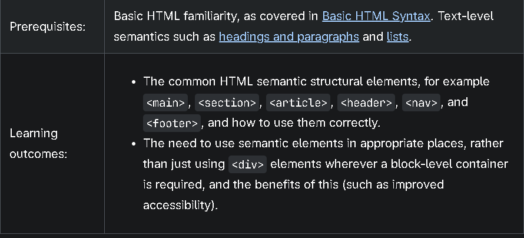
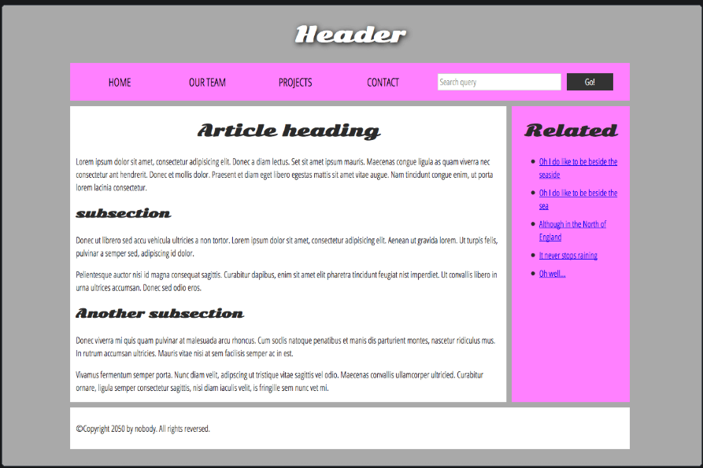

<!-- @format -->

In addition to defining individual parts of your page (such as "a paragraph" or "an image"), HTML also boasts a number of block level elements used to define areas of your website such as "the header", "the navigation menu", or "the main content column". This article looks into how to plan a basic website structure, and write the HTML to represent this structure.

Basic sections of a document

Basic sections of a document
Webpages can and will look pretty different from one another, but they all tend to share similar standard components, unless the page is displaying a fullscreen video or game, is part of some kind of art project, or is just badly structured:

header:
Usually a big strip across the top with a big heading, logo, and perhaps a tagline. This usually stays the same from one page of a website to another.

navigation bar:
Links to the site's main sections; usually represented by menu buttons, links, or tabs. Like the header, this content usually remains consistent from one webpage to another — having inconsistent navigation on your website will just lead to confused, frustrated users. Many web designers consider the navigation bar to be part of the header rather than an individual component, but that's not a requirement; in fact, some also argue that having the two separate is better for accessibility, as screen readers can read the two features better if they are separate.

main content:
A big area in the center that contains most of the unique content of a given webpage, for example, the video you want to watch, or the main story you're reading, or the map you want to view, or the news headlines, etc. This is the one part of the website that definitely will vary from page to page!

sidebar:
Some peripheral info, links, quotes, ads, etc. Usually, this is contextual to what is contained in the main content (for example on a news article page, the sidebar might contain the author's bio, or links to related articles) but there are also cases where you'll find some recurring elements like a secondary navigation system.

footer:
A strip across the bottom of the page that generally contains fine print, copyright notices, or contact info. It's a place to put common information (like the header) but usually, that information is not critical or secondary to the website itself. The footer is also sometimes used for SEO purposes, by providing links for quick access to popular content.

A "typical website" could be structured something like this:

Note: The image above illustrates the main sections of a document, which you can define with HTML. However, the appearance of the page shown here — including the layout, colors, and fonts — is achieved by applying CSS to the HTML.

HTML for structuring content
The example shown above isn't pretty, but it is perfectly fine for illustrating a typical website layout example. Some websites have more columns, some are a lot more complex, but you get the idea. With the right CSS, you could use pretty much any elements to wrap around the different sections and get it looking how you wanted, but as discussed before, we need to respect semantics and use the right element for the right job.

This is because visuals don't tell the whole story. We use color and font size to draw sighted users' attention to the most useful parts of the content, like the navigation menu and related links, but what about visually impaired people for example, who might not find concepts like "pink" and "large font" very useful?

To implement such semantic mark up, HTML provides dedicated tags that you can use to represent such sections, for example:

header: <header>.
navigation bar: <nav>.
main content: <main>, with various content subsections represented by <article>, <section>, and 
 elements.
sidebar: <aside>; often placed inside <main>.
footer: <footer>.
