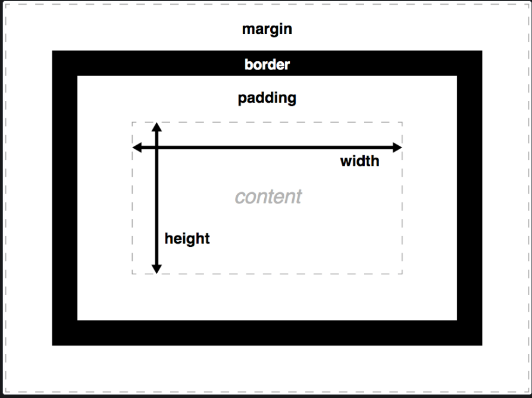

<!-- @format -->

The CSS box model module defines the margin and padding properties, which along with the height, width and border properties, make up the CSS box model.

Every visible element on a webpage is a box laid out according to the visual formatting model. CSS properties define their size, position, and stacking level, with the box model properties (and others) defining the extrinsic size of each box, and the space around them.

Each box has a rectangular content area, inside which any text, images, and other content is displayed. The content may be surrounded by padding, a border, and a margin, on one or more sides. The padding is around the content, the border is around the padding, and the margin sits outside the border. The box model describes how these features — the content, padding, border, and margin — work together to create a box as displayed by CSS.

