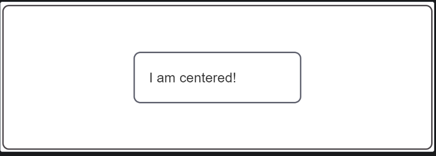

<!-- @format -->

Center an element
In this recipe, you will see how to center one box inside another by using flexbox and grid, centering content both horizontally and vertically.

Using flexbox
To center a box within another box, first turn the containing box into a flex container by setting its display property to flex. Then set align-items to center for vertical centering (on the block axis) and justify-content to center for horizontal centering (on the inline axis). And that's all it takes to center one box inside another!
