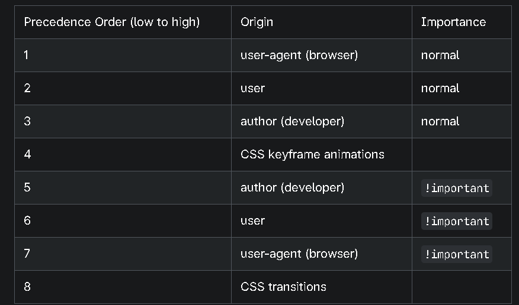

<!-- @format -->

Origin types
The CSS cascade algorithm's job is to select CSS declarations in order to determine the correct values for CSS properties. CSS declarations come from different origin types: User-agent stylesheets, Author stylesheets, and User stylesheets.

Though stylesheets come from these different origins and can be within different layers in each of these origins, they overlap in terms of their default scope; to make this work, the cascade algorithm defines how they interact. Before addressing the interactions, we'll define some key terms in the next few sections.

Important!!
User-agent stylesheets

User-agents, or browsers, have basic stylesheets that give default styles to any document. These stylesheets are named user-agent stylesheets. Most browsers use actual stylesheets for this purpose, while others simulate them in code. The end result is the same.

Some browsers let users modify the user-agent stylesheet, but this is rare and not something that can be controlled.

Although some constraints on user-agent stylesheets are set by the HTML specification, browsers have a lot of latitude: that means some differences exist between browsers. To simplify the development process, Web developers may use a CSS reset stylesheet, such as normalize.css, which sets common properties values to a known state for all browsers before beginning to make alterations to suit their specific needs.

Unless the user-agent stylesheet includes an !important next to a property, making it "important", styles declared by author styles, including a reset stylesheet, take precedence over the user-agent styles, regardless of the specificity of the associated selector.

Author stylesheets
Author stylesheets are the most common type of stylesheet; these are the styles written by web developers. These styles can reset user-agent styles, as noted above, and define the styles for the design of a given web page or application. The author, or web developer, defines the styles for the document using one or more linked or imported stylesheets, <style> blocks, and inline styles defined with the style attribute. These author styles define the look and feel of the website — its theme.

User stylesheets
In most browsers, the user (or reader) of the website can choose to override styles using a custom user stylesheet designed to tailor the experience to the user's wishes. Depending on the user agent, user styles can be configured directly or added via browser extensions.

Cascade layers
The cascade order is based on origin type. The cascade within each origin type is based on the declaration order of cascade layers within that type. For all origins - user-agent, author, or user - styles can be declared within or outside of named or anonymous layers. When declared using layer, layer() or @layer, styles are placed into the specified named layer, or into an anonymous layer if no name is provided. Styles declared outside of a layer are treated as being part of an anonymous last declared layer.

Let's take a look at cascading origin type before diving into cascade layers within each origin type.

Cascading order
The cascading algorithm determines how to find the value to apply for each property for each document element. The following steps apply to the cascading algorithm:

Relevance: It first filters all the rules from the different sources to keep only the rules that apply to a given element. That means rules whose selector matches the given element and which are part of an appropriate media at-rule.

Origin and importance: Then it sorts these rules according to their importance, that is, whether or not they are followed by !important, and by their origin. Ignoring layers for the moment, the cascade order is as follows:

Specificity: In case of equality with an origin, the specificity of a rule is considered to choose one value or another. The specificity of the selectors are compared, and the declaration with the highest specificity wins.

Scoping proximity: When two selectors in the origin layer with precedence have the same specificity, the property value within scoped rules with the smallest number of hops up the DOM hierarchy to the scope root wins. See How @scope conflicts are resolved for more details and an example.

Order of appearance: In the origin with precedence, if there are competing values for a property that are in style block matching selectors of equal specificity and scoping proximity, the last declaration in the style order is applied.

The cascade is in ascending order, meaning:

Animations take precedence over normal values, whether declared in user, author, or user-agent styles.
Important values take precedence over animations, whether declared in user, author, or user-agent styles.
Transitions take precedence over important values.
